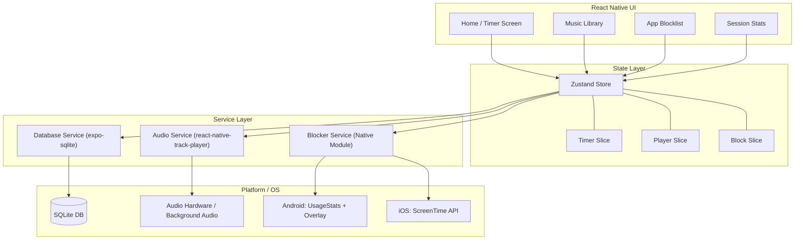
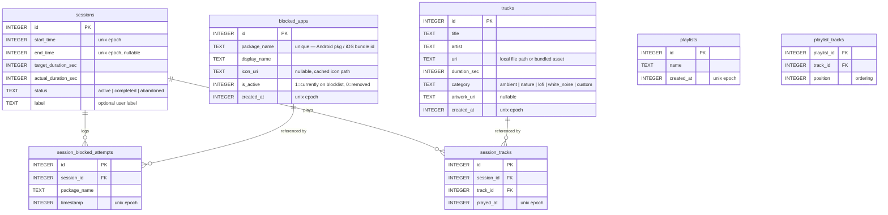
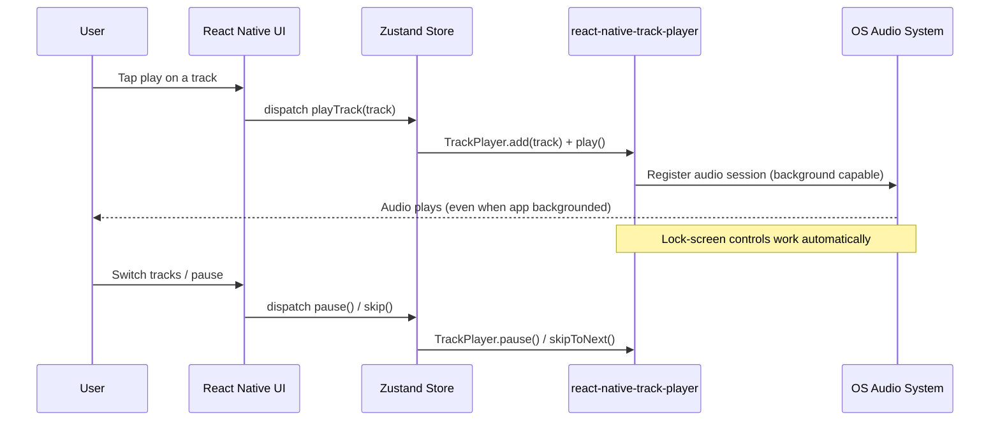
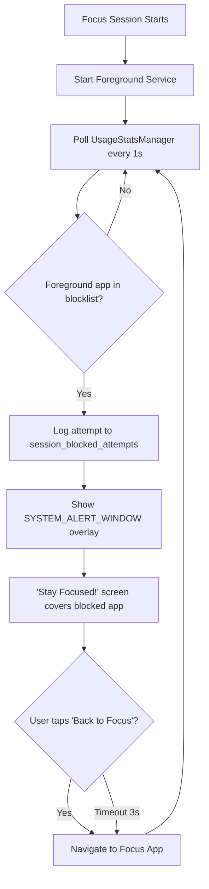

# Focus App — System Design

> A React Native mobile app that helps users concentrate by combining **ambient music playback** with **app blocking** during timed focus sessions. All data is stored locally via **SQLite**.

---

## 1. High-Level Architecture



### Tech Stack

| Layer | Choice | Why |
|---|---|---|
| Framework | **Expo (Dev Build)** | Managed workflow + custom native modules via dev client |
| Language | **TypeScript** | Type safety across the entire codebase |
| Navigation | **expo-router** (file-based) | Convention over configuration, deep linking |
| State | **Zustand** | Lightweight, no boilerplate, works outside components |
| Database | **expo-sqlite** | First-party Expo SQLite driver, synchronous API |
| Audio | **react-native-track-player** | Background playback, lock-screen controls, queue mgmt |
| Fast KV | **react-native-mmkv** | User preferences / settings (non-relational) |
| Animations | **react-native-reanimated** | 60fps UI animations on the native thread |

---

## 2. SQLite Database Schema



### DDL

```sql
-- Focus sessions
CREATE TABLE IF NOT EXISTS sessions (
    id                  INTEGER PRIMARY KEY AUTOINCREMENT,
    start_time          INTEGER NOT NULL,
    end_time            INTEGER,
    target_duration_sec INTEGER NOT NULL,
    actual_duration_sec INTEGER DEFAULT 0,
    status              TEXT NOT NULL CHECK(status IN ('active','completed','abandoned')),
    label               TEXT
);

-- Audio tracks (bundled + user-imported)
CREATE TABLE IF NOT EXISTS tracks (
    id           INTEGER PRIMARY KEY AUTOINCREMENT,
    title        TEXT NOT NULL,
    artist       TEXT DEFAULT 'Unknown',
    uri          TEXT UNIQUE NOT NULL,
    duration_sec INTEGER,
    category     TEXT DEFAULT 'ambient'
                     CHECK(category IN ('ambient','nature','lofi','white_noise','custom')),
    artwork_uri  TEXT,
    created_at   INTEGER NOT NULL
);

-- Apps the user wants blocked during focus
CREATE TABLE IF NOT EXISTS blocked_apps (
    id           INTEGER PRIMARY KEY AUTOINCREMENT,
    package_name TEXT UNIQUE NOT NULL,
    display_name TEXT NOT NULL,
    icon_uri     TEXT,
    is_active    INTEGER DEFAULT 1,
    created_at   INTEGER NOT NULL
);

-- Log of every time a blocked app was intercepted
CREATE TABLE IF NOT EXISTS session_blocked_attempts (
    id           INTEGER PRIMARY KEY AUTOINCREMENT,
    session_id   INTEGER NOT NULL REFERENCES sessions(id) ON DELETE CASCADE,
    package_name TEXT NOT NULL,
    timestamp    INTEGER NOT NULL
);

-- Which tracks were played in which session
CREATE TABLE IF NOT EXISTS session_tracks (
    id         INTEGER PRIMARY KEY AUTOINCREMENT,
    session_id INTEGER NOT NULL REFERENCES sessions(id) ON DELETE CASCADE,
    track_id   INTEGER NOT NULL REFERENCES tracks(id) ON DELETE CASCADE,
    played_at  INTEGER NOT NULL
);

-- User-created playlists
CREATE TABLE IF NOT EXISTS playlists (
    id         INTEGER PRIMARY KEY AUTOINCREMENT,
    name       TEXT NOT NULL,
    created_at INTEGER NOT NULL
);

-- Join table for playlist ordering
CREATE TABLE IF NOT EXISTS playlist_tracks (
    playlist_id INTEGER NOT NULL REFERENCES playlists(id) ON DELETE CASCADE,
    track_id    INTEGER NOT NULL REFERENCES tracks(id) ON DELETE CASCADE,
    position    INTEGER NOT NULL,
    PRIMARY KEY (playlist_id, track_id)
);

-- Indexes for common queries
CREATE INDEX IF NOT EXISTS idx_sessions_status ON sessions(status);
CREATE INDEX IF NOT EXISTS idx_sessions_start ON sessions(start_time);
CREATE INDEX IF NOT EXISTS idx_blocked_attempts_session ON session_blocked_attempts(session_id);
```

---

## 3. Feature: Music Player

### How it works



### Key Design Decisions

| Decision | Choice | Rationale |
|---|---|---|
| Audio library | `react-native-track-player` | Only RN lib with full background audio + media controls + queue |
| Bundled tracks | ~8-10 ambient/noise loops shipped as assets | Works offline from first launch, no network needed |
| User imports | `expo-document-picker` → copy to app sandbox | User owns the file, persists across sessions |
| Track metadata | Stored in SQLite `tracks` table | Fast queries for search, filtering by category |
| Playlists | SQLite join table with `position` column | Drag-to-reorder support |
| Background audio | iOS `UIBackgroundModes: audio`, Android foreground service | OS-level requirement for uninterrupted playback |

---

## 4. Feature: App Blocking

> [!IMPORTANT]
> App blocking is the most platform-divergent feature. Android offers robust APIs; iOS is heavily sandboxed.

### Android Strategy



**Required Permissions:**
- `PACKAGE_USAGE_STATS` — user grants in Settings → Apps → Usage Access
- `SYSTEM_ALERT_WINDOW` — draw overlay on top of other apps
- `FOREGROUND_SERVICE` — keep the blocking service alive

**Native Module Needed:** A Kotlin/Java module exposing:
- `getInstalledApps()` → returns `{ packageName, displayName, iconBase64 }[]`
- `startBlockingService(packageNames: string[])` → starts the foreground service
- `stopBlockingService()` → stops monitoring
- `checkPermissions()` → returns which permissions are granted/missing

### iOS Strategy

**Primary approach — ScreenTime API (iOS 15+):**
- `FamilyControls` framework for authorization
- `ManagedSettings` to apply app shields
- `DeviceActivity` to monitor schedule-based blocking
- User selects apps via the native `FamilyActivityPicker` (Apple doesn't expose app identifiers directly)

**Limitation:** Requires the `Family Controls` entitlement from Apple (available for approved developer accounts).

**Fallback approach (no entitlement):**
- Full-screen "Stay Focused" reminder via local notifications + app foreground detection
- Not a true block, but a strong nudge

> [!NOTE]
> For the initial build, we will **target Android first** for full app-blocking functionality, with iOS getting the ScreenTime integration as a Phase 2 effort.

---

## 5. Project Structure

```
focus/
├── app/                          # expo-router file-based routes
│   ├── (tabs)/
│   │   ├── _layout.tsx           # Tab navigator setup
│   │   ├── index.tsx             # Home / Timer screen
│   │   ├── music.tsx             # Music library & player
│   │   ├── blocklist.tsx         # App blocklist manager
│   │   └── stats.tsx             # Session statistics
│   ├── _layout.tsx               # Root layout (providers, DB init)
│   └── modals/
│       └── track-picker.tsx      # Modal for importing tracks
├── components/
│   ├── timer/
│   │   ├── CircularProgress.tsx  # Animated ring timer
│   │   └── TimerControls.tsx     # Start / pause / abandon
│   ├── music/
│   │   ├── TrackCard.tsx         # Individual track row
│   │   ├── MiniPlayer.tsx        # Persistent bottom bar player
│   │   ├── NowPlaying.tsx        # Full-screen now-playing view
│   │   └── CategoryChips.tsx     # Horizontal filter chips
│   ├── blocker/
│   │   ├── AppListItem.tsx       # Toggle app on/off blocklist
│   │   └── PermissionGuide.tsx   # Step-by-step permission setup
│   └── stats/
│       ├── WeeklyChart.tsx       # Bar chart of daily focus time
│       └── BlockedCounter.tsx    # Total blocked attempts card
├── services/
│   ├── database.ts               # SQLite init, migrations, query helpers
│   ├── audio.ts                  # react-native-track-player wrapper
│   └── blocker.ts                # Native module bridge (Android/iOS)
├── stores/
│   ├── useTimerStore.ts          # Zustand slice for timer state
│   ├── usePlayerStore.ts         # Zustand slice for audio player
│   └── useBlockStore.ts         # Zustand slice for blocklist
├── hooks/
│   ├── useDatabase.ts            # DB query hooks
│   └── usePermissions.ts         # Permission status hooks
├── constants/
│   ├── colors.ts                 # Design tokens (dark theme palette)
│   └── bundledTracks.ts          # Metadata for shipped audio assets
├── assets/
│   ├── audio/                    # Bundled ambient tracks (.mp3)
│   └── images/                   # Icons, artwork
├── android/
│   └── app/src/main/java/.../
│       ├── BlockingService.kt    # Foreground service for app monitoring
│       └── BlockerModule.kt      # React Native native module bridge
└── package.json
```

---

## 6. Screen Designs (Conceptual)

### Timer Screen (Home)
- **Dark gradient background** with subtle floating particle animation
- **Large circular progress ring** (animated via Reanimated) — shows remaining time
- **Session label** input at top (optional tag like "Deep Work", "Study")
- **Duration presets**: 25m / 45m / 60m / custom
- **Start / Pause / Give Up** — primary CTA button morphs between states
- **Mini player bar** pinned at bottom showing current track + play/pause

### Music Screen
- **Category chips** at top: All · Ambient · Nature · Lo-Fi · White Noise · My Tracks
- **Track list** with artwork thumbnails, title, artist, duration
- **Now Playing** expandable bottom sheet with waveform visualization
- **Import button** (FAB) to add local audio files

### Blocklist Screen
- **Search bar** to filter installed apps
- **App list** with icons + toggle switches
- **Permission status banner** at top if required permissions aren't granted
- **"Blocked X apps" counter** summary

### Stats Screen
- **Weekly bar chart** — focus minutes per day
- **Streak counter** — consecutive days with ≥1 completed session
- **Completion rate** — completed vs abandoned pie chart
- **Blocked attempts** — total distraction blocks this week

---

## 7. Development Phases

| Phase | Scope | Key Deliverables |
|---|---|---|
| **1 — Scaffold** | Project init, navigation, DB setup | Expo dev build, tab navigation, SQLite schema created on launch |
| **2 — Timer** | Core focus timer logic | Countdown timer with circular UI, session persistence to DB |
| **3 — Music** | Audio playback + library | Track player integration, bundled tracks, background audio, mini player |
| **4 — Blocker (Android)** | Native blocking module | Kotlin foreground service, overlay screen, permission flow |
| **5 — Stats** | Session analytics | Weekly chart, completion rate, blocked attempt counts |
| **6 — Polish** | UI refinement, edge cases | Animations, error handling, onboarding flow |

---

## 8. Open Questions for You

1. **Android-first OK?** iOS app blocking requires Apple entitlements — should we defer iOS blocking to a later phase?
2. **Bundled audio**: Should I source/generate a set of royalty-free ambient loops to ship with the app, or will you provide audio files?
3. **Timer style**: Classic Pomodoro (25m work / 5m break cycles) or free-form custom durations only?
4. **Notifications**: Should the app send a notification when a focus session completes or when someone tries to open a blocked app?
